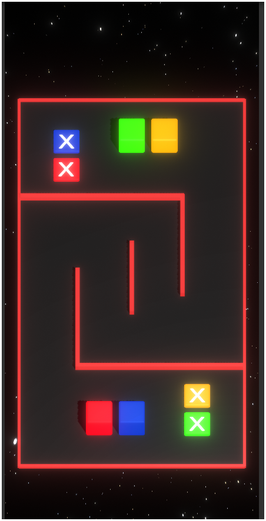
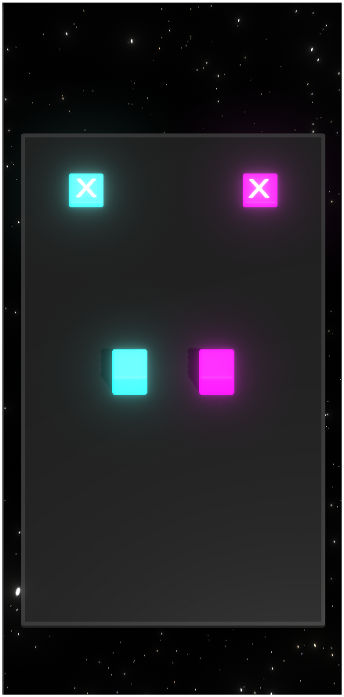
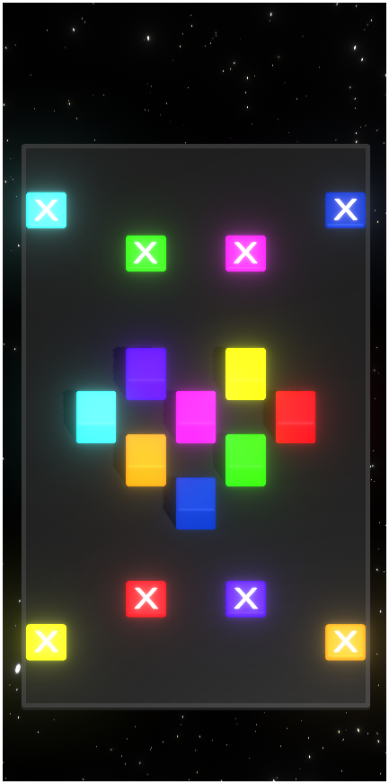

# Lost Cubes 🎲🟥🟦🟩

**Android puzzle game built with Unity.**  
Quick, satisfying puzzles centered on colored cubes, built for short mobile sessions with steadily rising challenge.

**▶ Play on Google Play:** _TBD_  
**Demo video:** _TBD ([YouTube link](https://youtube.com/shorts/sKUxP6k_Bls?feature=share))_

---

## ✨ Highlights
- **Snack-sized levels** designed for mobile play.  
- **Clear visual language** (color-first UI) with responsive feedback.  
- **Progression that ramps smoothly** (difficulty, patterns, speed).  
- **Runs well on low-end devices**; small install size.

---

## 📸 Screenshots

```html
<p align="center">
  
  
  
</p>
```


---

## 🧩 Game Overview
Drag each cube to the base with the same color to solve the puzzle and move to the next stage.
With 15 levels of increasing difficulty, the game helps develop logic, attention, and problem-solving skills.

---

## 🛠️ Tech Stack
- **Engine:** Unity (LTS recommended)  
- **Scripting:** C#  
- **Target:** Android (AAB for Play Store)  
- **Build:** IL2CPP, ARM64/ARMv7 (update if different)  

---

## 🗂️ Repository Layout (source only)
This repository intentionally **excludes builds and secrets**.

```
Assets/             # Game code, scenes, prefabs, art (with .meta files)
ProjectSettings/    # Unity project configuration
Packages/           # manifest.json + packages-lock.json
.gitignore          # excludes Library/, Builds/, *.apk/*.aab, keystore, etc.
README.md
```

---

## 🔒 Data Safety
- No data collected or shared.

---


## 🙌 Credits
- **Developer:** Rayek  
